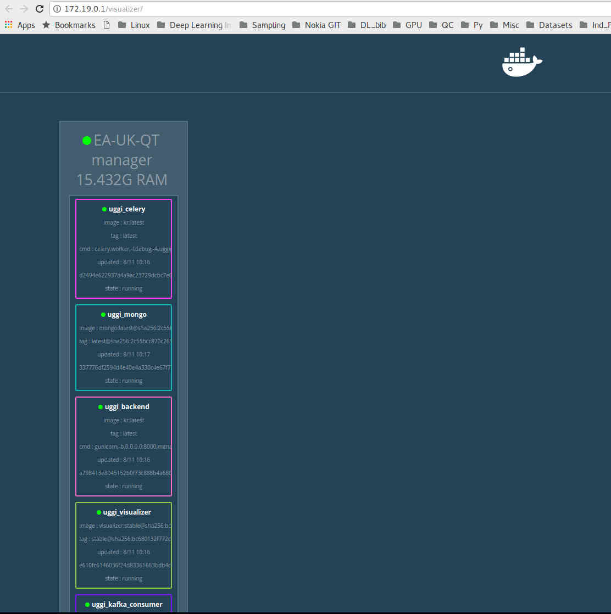

# UGGIPUGGI BACKEND 
Built with Python, and more specifically with Falcon REST web framework, MongoEngine (python client for MongoDB), 
REDIS, KAFKA and Celery.

To get started, please follow instructions below on how to setup your environment to run uggipuggi backend.

## Instructions

> #### Prerequisites for Local Environment
> Uggipuggi backend is using microservices architecture and all the services are containerized using Docker and run
> using Docker Swarm
> Install latest version of Docker, Linux system is preferred and tested

Once Docker is installed, just run the localsetup.sh to run the system (might take a couple of minutes to start). 
The script at the end prints the web address your backend is listening (Gateway)and also intructions to see the 
logs for each microservice. For me this is what is printed:

```
======================================================
For logs: docker service logs -f stackname_servicename
Docker Overlay Network:
Gateway: 172.19.0.1 Subnet: 172.19.0.0/16 
======================================================
```

The script also automatically opens two browser tabs. The two browser tabs opened are 172.19.0.0/test and 
172.19.0.0/visualizer/. The first tab just prints "{"Uggi": "Puggi"}" showing that the backend is responding 
to HTTP requests. The second tab should show the following where it shows the status of different services 
(the color of the boxes does not matter, the green dot shows the service is healthy).



Now you are good to go :-)

To try a POST request, you can do the following via the Terminal:

```
$ curl -X  POST -H "Content-Type:application/json" -d '[PAYLOAD HERE]' http://backend_web_address/recipes
```

If you wish to see the response in prettyprint, you can pipe the response with Python's json module: `| python -m json.tool`

Of course, you may prefer to use POSTMAN.io (easy GUI) to make these POST request. That is fine too.
Do note that Uggipuggi only accepts json [content-type](http://en.wikipedia.org/wiki/Internet_media_type) for POST requests.


## API methods (under construction)

A list of API methods can be found [here](endpoints.md)

